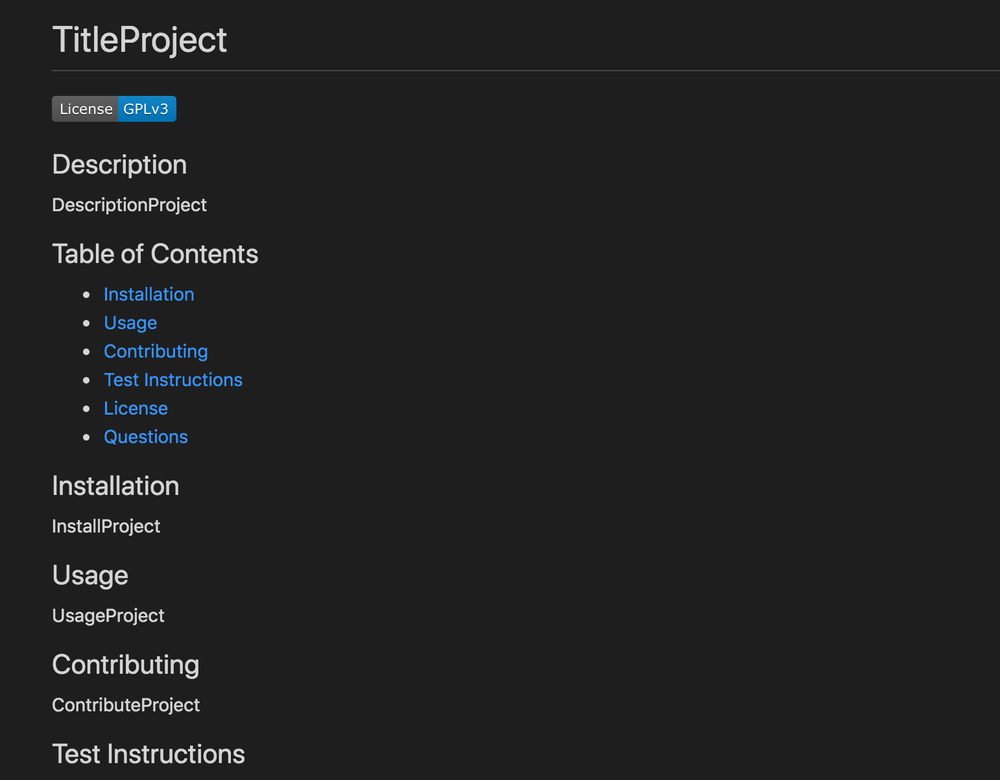

# readme-generator

This node.js application prompts the user to input data to create a professional README file. The file includes the title of the project, a project description, installation instructions, usage information, contribution guidelines, test instructions, the project license, and contact information for the project creator, including their GitHub profile and their email. The generated file includes a table of contents for these sections.

To use the application, download the repository. Then, type ```npm install``` into the command line to install the necessary packages. From the main directory, type ```node index.js``` into the command line to run the application. Answer the prompts, and the file will be generated. Open the ```readme.md``` file in the ```dist``` directory to see the file.

To see a walkthrough of these steps, [watch this video.](https://drive.google.com/file/d/1gKmTqaDfe-VHFXOwxQx3Aloln6f3gd77/view)

